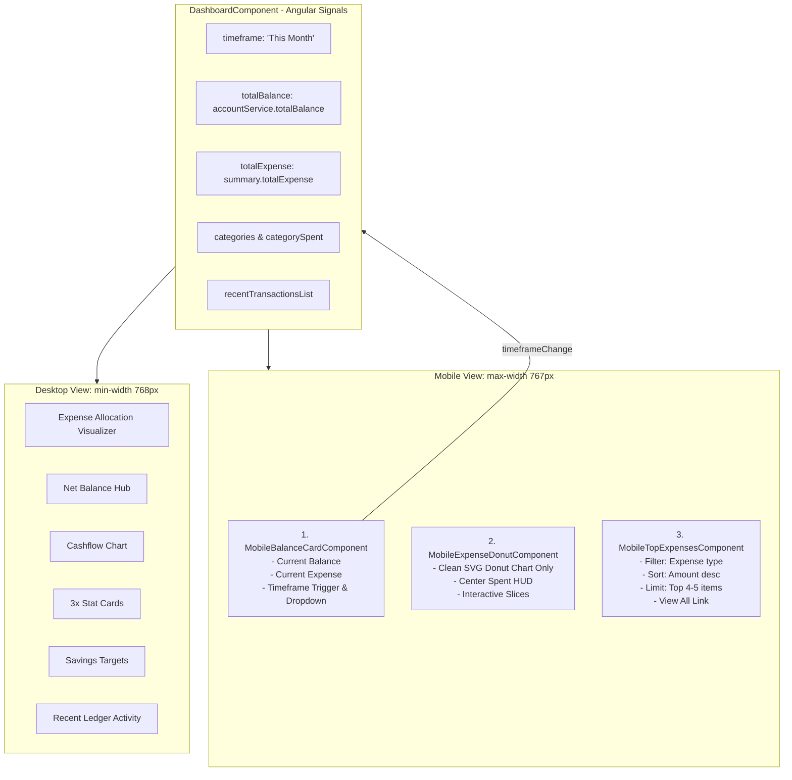

# Mobile View Dashboard Update (Issue #15)

Implementation plan for [GitHub Issue #15: Mobile view dashboard update](https://github.com/prodipdatta7/fintrack-angular-app/issues/15). This plan defines the architecture, design, and step-by-step implementation for transforming the FinTrack mobile dashboard into a focused, high-clarity 3-section layout optimized for mobile handsets (`< 768px`) while preserving the comprehensive analytics experience on desktop viewports (`>= 768px`).

---

## 1. Requirements & Constraints

### Business & Functional Requirements
- **REQ-001**: **Dedicated Mobile Layout Structure**: When viewed on mobile screens (`< 768px`), the dashboard must render a streamlined 3-section layout in the exact requested order:
  1. **Account Balance & Expense Info Card**
  2. **Self-Explanatory, Clean Donut Chart (Chart Only)**
  3. **Top Expense Transactions (4–5 items only)**
- **REQ-002**: **Mobile Balance Info Card (`MobileBalanceCardComponent`)**:
  - Displays the user's **Current Balance** (total net balance across all active accounts).
  - Displays the user's **Current Expense** (total outflows spent for the active period).
  - Defaults all calculations to the **current month** (`'This Month'`).
- **REQ-003**: **Hidden Time-Range Selector**:
  - Timeframe configuration is hidden behind a clean time-range icon button (`material-icons: date_range` / `tune`).
  - Clicking the icon reveals a smooth dropdown/popover menu with available presets (`'This Month'`, `'7D'`, `'15D'`, `'30D'`, `'6M'`, `'This Year'`, `'Custom'`).
  - Switching timeframes immediately updates all calculations on the card, donut chart, and top expenses list.
- **REQ-004**: **Self-Explanatory, Clean Category Expense Donut Chart (`MobileExpenseDonutComponent`)**:
  - Renders directly below the balance card as a dedicated, uncluttered chart section.
  - Displays a clean, conscious SVG Donut chart showing the distribution of expenses across categories (`CategorySpend[]`).
  - **No list underneath**: Only the clean, self-contained donut visualizer with interactive touch/hover slice feedback.
  - Includes a center HUD (total outflow spent formatted via `AppCurrencyPipe` + active category/period indicator).
  - Displays an elegant empty state if no expenses are recorded for the active period.
- **REQ-005**: **Top Expense Transactions This Month (`MobileTopExpensesComponent`)**:
  - Displays the **top 4–5 expense transactions** in the current month / active timeframe.
  - Filters strictly for `type === CategoryType.Expense` transactions within the active date range.
  - Sorts transactions descending by amount (highest expense first).
  - Displays category icon, transaction title, account source badge, formatted date, and negative currency formatting (`- $XX.XX`).
  - Clicking a transaction navigates to `/transactions/details/:id`.
  - Includes a "View all transactions" footer link to `/transactions`.

### Technical & Architectural Constraints
- **CON-001**: **Desktop View Preservation**: The desktop dashboard view (`>= 768px`) must remain completely functional and unaltered with its rich analytical widgets (`NetBalanceHub`, `CashflowChart`, `StatCards`, `ExpenseAllocation`, `SavingsTargets`, `RecentActivity`).
- **CON-002**: **Zero New Runtime Dependencies**: Built strictly using Angular v20 standalone components, Angular Signals (`signal`, `computed`, `input`, `output`), and Vanilla SCSS + CSS Custom Properties.
- **CON-003**: **Mobile Usability Standards**: All interactive elements (time-range button, dropdown items, transaction cards) must respect a minimum touch target size of 44×44px and safe-area insets (`env(safe-area-inset-*)`).
- **PAT-001**: **Unidirectional Signal Flow**: State lives in `DashboardComponent` and passes down to mobile components via inputs; user interactions emit outputs to update the parent signals.

---

## 2. Implementation Steps

### Implementation Phase 1: Mobile Balance & Expense Summary Card
- **GOAL-001**: Build the `MobileBalanceCardComponent` displaying current balance, current expense (defaulting to current month), and a hidden time-range dropdown activated by an icon button.

| Task | Description | Completed | Date |
|---|---|---|---|
| TASK-001 | Create `mobile-balance-card.component.ts` with inputs (`totalBalance`, `totalExpense`, `activeTimeframe`, `timeframes`, `isLoading`), outputs (`timeframeChange`, `customRangeChange`), and toggle signal for timeframe popover | ✅ | 2026-08-31 |
| TASK-002 | Create `mobile-balance-card.component.html` with dual-metric glassmorphic card layout, calendar/tune icon trigger button, floating time-range dropdown menu, and custom date range picker integration | ✅ | 2026-08-31 |
| TASK-003 | Create `mobile-balance-card.component.scss` with glassmorphic styling, gradient balance accents, touch targets, and dropdown animation | ✅ | 2026-08-31 |
| TASK-004 | Create `mobile-balance-card.component.spec.ts` testing balance rendering, expense rendering, dropdown toggling, timeframe selection, and keyboard/click-outside dismiss | ✅ | 2026-08-31 |

### Implementation Phase 2: Minimal Category Expense Donut Chart (Chart Only)
- **GOAL-002**: Build `MobileExpenseDonutComponent` providing a self-explanatory, clean SVG donut chart showing category distribution with center HUD and touch/hover feedback without any category list.

| Task | Description | Completed | Date |
|---|---|---|---|
| TASK-005 | Create `mobile-expense-donut.component.ts` calculating SVG donut geometry from active category expenditures, handling slice hover/touch interactions, and exposing center HUD values | ✅ | 2026-08-31 |
| TASK-006 | Create `mobile-expense-donut.component.html` with self-explanatory SVG donut chart, center total amount/category tooltip HUD, and empty state | ✅ | 2026-08-31 |
| TASK-007 | Create `mobile-expense-donut.component.scss` with compact glass card styling, calibrated donut dimensions, and slice glow effects | ✅ | 2026-08-31 |
| TASK-008 | Create `mobile-expense-donut.component.spec.ts` validating empty state, slice geometry computation, center total rendering, and tooltip hover interaction | ✅ | 2026-08-31 |

### Implementation Phase 3: Top Expense Transactions Widget
- **GOAL-003**: Build `MobileTopExpensesComponent` displaying the top 4–5 expense transactions in the current month with details and direct navigation.

| Task | Description | Completed | Date |
|---|---|---|---|
| TASK-009 | Create `mobile-top-expenses.component.ts` with computed signal `topExpenses` that filters for `CategoryType.Expense`, applies date bounds for the active timeframe, sorts by `amount` descending, and caps at 5 items | ✅ | 2026-08-31 |
| TASK-010 | Create `mobile-top-expenses.component.html` rendering transaction cards (icon, title, account name, date, `- $amount`), detail navigation click handler, and "View all transactions" footer link | ✅ | 2026-08-31 |
| TASK-011 | Create `mobile-top-expenses.component.scss` with mobile card styling, touch targets, and negative currency emphasis | ✅ | 2026-08-31 |
| TASK-012 | Create `mobile-top-expenses.component.spec.ts` verifying expense filtering, top 4-5 amount-based ordering, detail navigation routing, and empty state | ✅ | 2026-08-31 |

### Implementation Phase 4: Dashboard Integration, Responsive Views & Unit Testing
- **GOAL-004**: Integrate mobile components into `DashboardComponent`, set up viewport-based CSS media query switching between `.dashboard-mobile-view` and `.dashboard-desktop-view`, and verify all tests.

| Task | Description | Completed | Date |
|---|---|---|---|
| TASK-013 | Update `dashboard.component.ts` importing and registering the new mobile standalone components | ✅ | 2026-08-31 |
| TASK-014 | Update `dashboard.component.html` wrapping desktop widgets in `.dashboard-desktop-view` and adding `.dashboard-mobile-view` with the 3 components | ✅ | 2026-08-31 |
| TASK-015 | Update `dashboard.component.scss` with `@include mobile-only` and `@include tablet-up` display rules to cleanly switch layouts at 768px | ✅ | 2026-08-31 |
| TASK-016 | Update `dashboard.component.spec.ts` adding specs for mobile components rendering, timeframe synchronization, and layout integrity | ✅ | 2026-08-31 |
| TASK-017 | Run test suite (`npm test -- --watch=false`) to ensure 100% test pass rate with zero regressions | ✅ | 2026-08-31 |

---

## 3. Alternatives

- **ALT-001: Inline Responsive CSS in Existing Widgets**:
  - *Description*: Modifying each desktop widget (`NetBalanceHub`, `ExpenseAllocation`, `RecentActivity`) to collapse into mobile modes rather than creating dedicated mobile components.
  - *Trade-off*: Would add high complexity and conditional flags to existing 400+ line components, risking desktop regressions. Dedicated mobile components keep separation of concerns clean, maintainable, and independently testable.
- **ALT-002: Always Use Bottom Navigation for Timeframe Selector**:
  - *Description*: Moving timeframe selection to a bottom sheet on mobile.
  - *Trade-off*: A localized dropdown directly attached to the balance card header keeps the control contextually anchored right where the user sees the balance and expenses without jarring full-screen overlay transitions.

---

## 4. Dependencies

- **DEP-001**: `AccountService` (`accounts`, `totalBalance`, `isLoading`)
- **DEP-002**: `DashboardService` (`summary`, `getSummary`, `isLoadingSummary`)
- **DEP-003**: `TransactionService` (`queryTransactions`)
- **DEP-004**: `AppCurrencyPipe` & `SignedCurrencyPipe`
- **DEP-005**: `styles/_breakpoints.scss` & `styles/_tokens.scss`

---

## 5. Files

- **FILE-001**: `[NEW]` [mobile-balance-card.component.ts](file:///d:/Local-Projects/fintrack-angular-app/src/app/features/dashboard/dashboard/components/mobile-balance-card/mobile-balance-card.component.ts)
- **FILE-002**: `[NEW]` [mobile-balance-card.component.html](file:///d:/Local-Projects/fintrack-angular-app/src/app/features/dashboard/dashboard/components/mobile-balance-card/mobile-balance-card.component.html)
- **FILE-003**: `[NEW]` [mobile-balance-card.component.scss](file:///d:/Local-Projects/fintrack-angular-app/src/app/features/dashboard/dashboard/components/mobile-balance-card/mobile-balance-card.component.scss)
- **FILE-004**: `[NEW]` [mobile-balance-card.component.spec.ts](file:///d:/Local-Projects/fintrack-angular-app/src/app/features/dashboard/dashboard/components/mobile-balance-card/mobile-balance-card.component.spec.ts)
- **FILE-005**: `[NEW]` [mobile-expense-donut.component.ts](file:///d:/Local-Projects/fintrack-angular-app/src/app/features/dashboard/dashboard/components/mobile-expense-donut/mobile-expense-donut.component.ts)
- **FILE-006**: `[NEW]` [mobile-expense-donut.component.html](file:///d:/Local-Projects/fintrack-angular-app/src/app/features/dashboard/dashboard/components/mobile-expense-donut/mobile-expense-donut.component.html)
- **FILE-007**: `[NEW]` [mobile-expense-donut.component.scss](file:///d:/Local-Projects/fintrack-angular-app/src/app/features/dashboard/dashboard/components/mobile-expense-donut/mobile-expense-donut.component.scss)
- **FILE-008**: `[NEW]` [mobile-expense-donut.component.spec.ts](file:///d:/Local-Projects/fintrack-angular-app/src/app/features/dashboard/dashboard/components/mobile-expense-donut/mobile-expense-donut.component.spec.ts)
- **FILE-009**: `[NEW]` [mobile-top-expenses.component.ts](file:///d:/Local-Projects/fintrack-angular-app/src/app/features/dashboard/dashboard/components/mobile-top-expenses/mobile-top-expenses.component.ts)
- **FILE-010**: `[NEW]` [mobile-top-expenses.component.html](file:///d:/Local-Projects/fintrack-angular-app/src/app/features/dashboard/dashboard/components/mobile-top-expenses/mobile-top-expenses.component.html)
- **FILE-011**: `[NEW]` [mobile-top-expenses.component.scss](file:///d:/Local-Projects/fintrack-angular-app/src/app/features/dashboard/dashboard/components/mobile-top-expenses/mobile-top-expenses.component.scss)
- **FILE-012**: `[NEW]` [mobile-top-expenses.component.spec.ts](file:///d:/Local-Projects/fintrack-angular-app/src/app/features/dashboard/dashboard/components/mobile-top-expenses/mobile-top-expenses.component.spec.ts)
- **FILE-013**: `[MODIFY]` [dashboard.component.ts](file:///d:/Local-Projects/fintrack-angular-app/src/app/features/dashboard/dashboard/dashboard.component.ts)
- **FILE-014**: `[MODIFY]` [dashboard.component.html](file:///d:/Local-Projects/fintrack-angular-app/src/app/features/dashboard/dashboard/dashboard.component.html)
- **FILE-015**: `[MODIFY]` [dashboard.component.scss](file:///d:/Local-Projects/fintrack-angular-app/src/app/features/dashboard/dashboard/dashboard.component.scss)
- **FILE-016**: `[MODIFY]` [dashboard.component.spec.ts](file:///d:/Local-Projects/fintrack-angular-app/src/app/features/dashboard/dashboard/dashboard.component.spec.ts)
- **FILE-017**: `[NEW]` [feature-mobile-dashboard-1.md](file:///d:/Local-Projects/fintrack-angular-app/plan/feature-mobile-dashboard-1.md)

---

## 6. Testing

- **TEST-001**: `mobile-balance-card.component.spec.ts`
  - Verifies formatted balance and expense values.
  - Verifies clicking time-range icon opens and closes the dropdown popover.
  - Verifies selecting a timeframe emits `timeframeChange` event and closes the menu.
- **TEST-002**: `mobile-expense-donut.component.spec.ts`
  - Verifies donut slice computation matches category spent proportions.
  - Verifies center total reflects total expense.
  - Verifies interactive slice hover/touch state updates.
  - Verifies empty state when total expenses are zero.
- **TEST-003**: `mobile-top-expenses.component.spec.ts`
  - Verifies filtering only for expense type transactions.
  - Verifies transactions are sorted descending by amount.
  - Verifies slicing to max 4–5 items.
  - Verifies row click navigates to `/transactions/details/:id`.
- **TEST-004**: `dashboard.component.spec.ts`
  - Verifies all mobile and desktop components are instantiated.
  - Verifies timeframe change from mobile component triggers dashboard summary refetch.
  - Full suite execution via `npm test -- --watch=false --browsers=ChromeHeadless`.

---

## 7. Risks & Assumptions

- **ASSUMPTION-001**: Total net balance is derived from `accountService.totalBalance()` (or sum of account balances), while current expense is derived from `summary().totalExpense` for the active timeframe (default current month).
- **ASSUMPTION-002**: Top expense transactions are filtered from the loaded transactions list where `type === CategoryType.Expense` within the month, sorted descending by amount to highlight the largest outflows.
- **RISK-001**: Dropdown menu clipping inside containers with `overflow: hidden`.
  - *Mitigation*: Ensure parent `.card-glass` container on mobile card uses `overflow: visible` or position dropdown menu with appropriate z-index (`z-index: 50`).

---

## 8. Related Specifications / Further Reading

- [GitHub Issue #15: Mobile view dashboard update](https://github.com/prodipdatta7/fintrack-angular-app/issues/15)
- [04 — Dashboard Master Plan](file:///d:/Local-Projects/fintrack-angular-app/docs/plans/04-dashboard.md)
- [Mobile Responsiveness Plan](file:///d:/Local-Projects/fintrack-angular-app/specs/mobile-responsiveness/plan.md)
